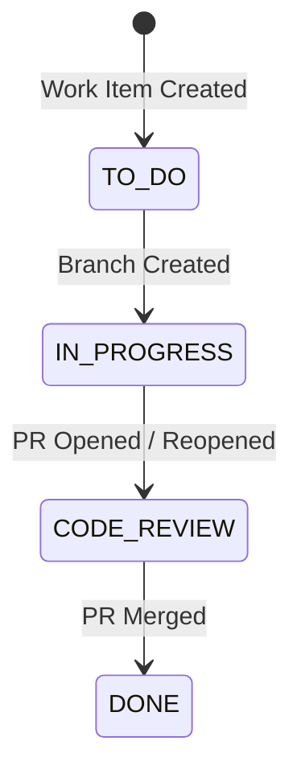

# GitHub ↔ Work Item Linking Reference

This document outlines the linking mechanism connecting work items (Epics, Features, User Stories, Tasks, and Bugs) with GitHub objects.

---

## 1. WorkItemGitHubLink Schema

The database model tracks all associations:

```prisma
model WorkItemGitHubLink {
  id                 String       @id @default(uuid())
  organizationId     String
  organization       Organization @relation(fields: [organizationId], references: [id], onDelete: Cascade)
  workItemId         String
  workItem           WorkItem     @relation(fields: [workItemId], references: [id], onDelete: Cascade)
  githubConnectionId String?
  repositoryId       String?
  repositoryFullName String       // e.g. "owner/repo"
  repositoryUrl      String?
  branchName         String?
  commitSha          String?
  commitMessage      String?
  pullRequestNumber  Int?
  pullRequestTitle   String?
  pullRequestUrl     String?
  relationshipType   String       // BRANCH | COMMIT | PULL_REQUEST
  createdById        String?
  createdAt          DateTime     @default(now())
  updatedAt          DateTime     @updatedAt

  @@index([organizationId])
  @@index([workItemId])
  @@index([repositoryFullName])
  @@index([branchName])
  @@index([pullRequestNumber])
}
```

---

## 2. Detection & Linking Triggers

Work item associations are detected and linked across four channels:

1. **UI Branch Modal**:
   - Creates a new branch on GitHub and creates a `WorkItemGitHubLink` record with `relationshipType: 'BRANCH'`.
2. **UI Pull Request Modal**:
   - Opens a GitHub PR linked to the work item and creates a `WorkItemGitHubLink` record with `relationshipType: 'PULL_REQUEST'`.
3. **Commit Messages via Webhooks**:
   - Regular expression `\b([A-Z0-9]+-\d+)\b` extracts all work-item identifiers (e.g. `[PROJ-12] Added login page`).
4. **PR Titles / Descriptions**:
   - Automatically links PRs referencing work items (e.g. `Fixes PROJ-44` or `feat: [PROJ-88] Add dark mode`).

---

## 3. Automated Status State Machine



- When a PR is created or reopened: Work Item $\rightarrow$ `CODE_REVIEW`.
- When a PR is merged: Work Item $\rightarrow$ `DONE`.
- Linked activities are written to `WorkItemStatusHistory` and posted as updates in the project chat channel.
