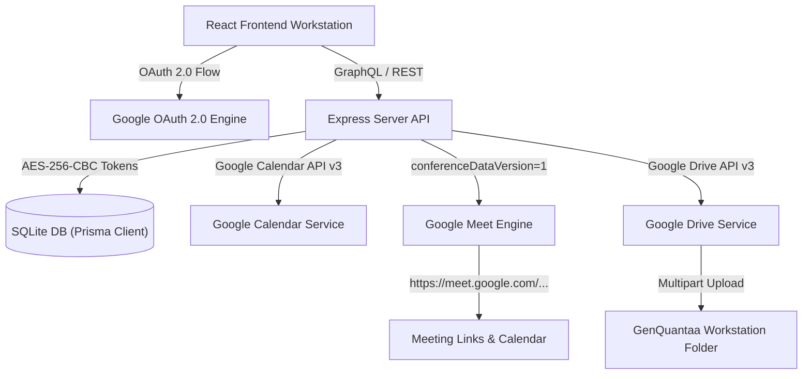

# Google Workspace Integration Overview

## Executive Summary
This document details the complete end-to-end integration between the Antigravity Team Management Enterprise Platform and Google Workspace APIs, providing Google OAuth 2.0 single sign-on, Google Calendar event synchronization, Google Meet instant video conference room generation, and Google Drive document attachment storage.

## Architectural Overview

## Key Features & Capabilities
1. **Google OAuth 2.0 Web Flow**: Single sign-on and token delegation with `openid`, `email`, `profile`, `calendar.events`, `calendar.events.freebusy`, and `drive.file` scopes.
2. **UI-Based Admin Configuration**: Admin panel located at `Settings -> Integrations -> Google Workspace` allowing live configuration of Client ID, Client Secret, and Authorized Redirect URIs without manual `.env` file editing.
3. **Google Calendar API Integration**: Full CRUD operation support for calendar events, free/busy availability queries, and multi-attendee invitations.
4. **Google Meet Conference Room Generation**: Automatic creation of real `https://meet.google.com/...` video call links via `conferenceDataVersion=1` and unique `requestId` parameters.
5. **Google Drive Document Storage**: Organizational folder hierarchy (`GenQuantaa Workstation / Organization / Projects / <Project>`), multipart upload streaming, download streaming, and DB tracking via `FileAttachment` model.
